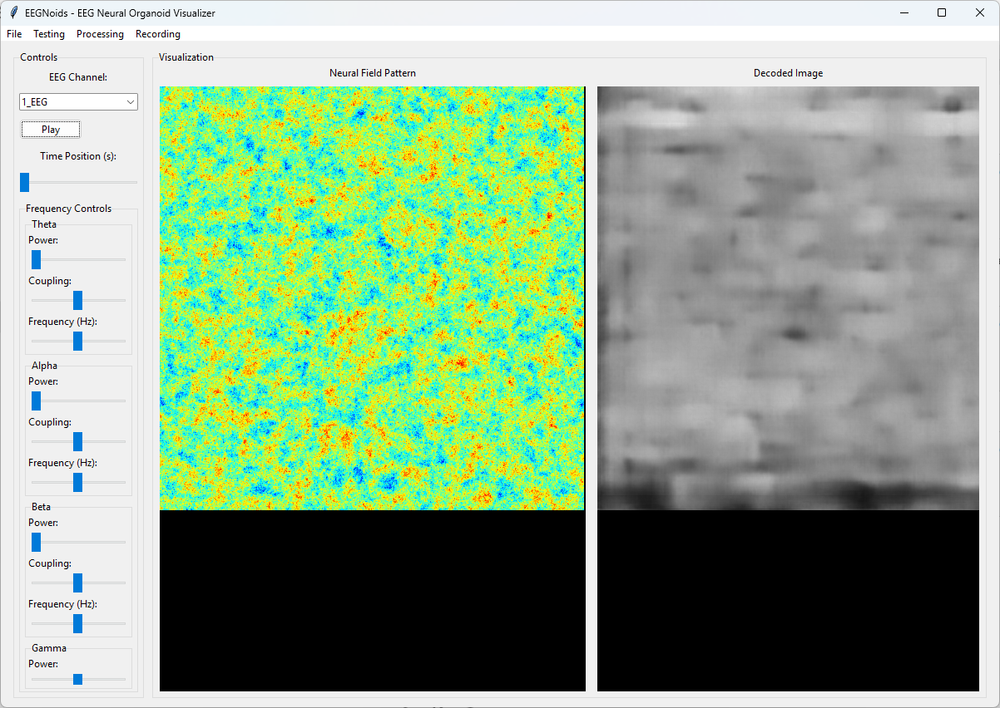

# Brain Decoder 2

EDIT: I added the star pattern neural field system that made the most interesting models. Else it has problems, 
the models trained with it work with the app.py too in which channel selection etc work. 

**Yet another - EEG Neural Visualizer**

Braindecoder 2 is a Python-based application that visualizes EEG data through neural fields and decodes them into images using a trained U-Net model. The application features a graphical user interface (GUI) built with Tkinter, allowing users to load EEG data, switch between channels, visualize neural field patterns, decode images, and log performance metrics.

## Features

- **EEG Data Processing:** Load and analyze EEG data from EDF files.
- **Neural Field Generation:** Generate neural field patterns based on EEG frequencies.
- **Image Decoding:** Decode neural fields into images using a U-Net model.
- **Graphical User Interface:** Interactive GUI for visualization and controls.
- **Training and Testing:** Train the U-Net model and evaluate its performance.
- **Video Recording:** Record visualizations as videos.

## Installation

git clone https://github.com/anttiluode/BrainDecoder2/

cd BrainDecoder2

Install Dependencies

numpy
torch
torchvision
mne
opencv-python
Pillow
scikit-image
scipy
matplotlib

# Usage

Run the Application:

python app.py

# Download the model

You can download a model with 144 epochs from huggingface: 

https://huggingface.co/Aluode/Braindecoder/tree/main

OR 

# Train the Model:

Training the Image Decoder

You can create neural field patterns of your images with the included batch image processor. 

Number of training epochs are on the line 2006 - It is 1200 by default which will take days. 

In the GUI, navigate to the Processing menu.

Select Train Model.

Choose the directory containing original images.

Choose the directory where you want to put the field images.

The training process will start, displaying progress. Best models are saved as best_model.pth in the project root. 

# Saving and Loading Models

Save Model:

Navigate to the File menu.
Select Save Model to save the current U-Net model state.

Load Model:

Navigate to the File menu.
Select Load Model to load a pre-trained U-Net model.

# Testing the Image Decoder

After training, you can test the decoder's performance on new image pairs or standalone field images.

Test on Standalone Field Images:

Navigate to the Testing menu.

Select Decode Field Image.

Choose a field image to decode. The decoded image will be displayed without requiring a paired original.

# Using the GUI for EEG Visualization

Load EEG Data:

Navigate to the File menu.

Select Load EEG and choose an EDF file containing EEG data.

Select EEG Channel:

Use the dropdown to select a specific EEG channel. The neural field visualization will update accordingly.

Playback Controls:

Use the Play button to start or pause the visualization.

Adjust the Time Position slider to seek within the EEG data.

What ever images you see, most likely come from the interplay of the Image model and the "biological bridge"
that is bunch of neuron simulations interacting with the image model neural network. 

So while the neural field is derived from the eeg, it is unlikely that the images you see are actually 
coming from the eeg, even though the eeg does have a effect on the stream of images coming and going. 
You may even see something that was not on the training set, but that is most likely a effect of the 
latent space of the image model. 

# Adjust Frequency Controls:

Modify power, coupling, and frequency settings for different EEG frequency bands (theta, alpha, beta, gamma) to influence the neural field patterns.

# Recording:

Navigate to the Recording menu.
Select Start Recording to begin capturing the visualization.
Select Stop Recording to end and save the video.

# License

This project is licensed under the MIT License.
